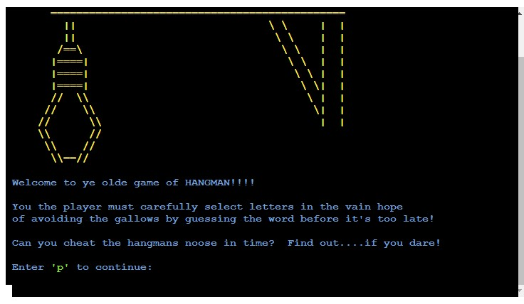
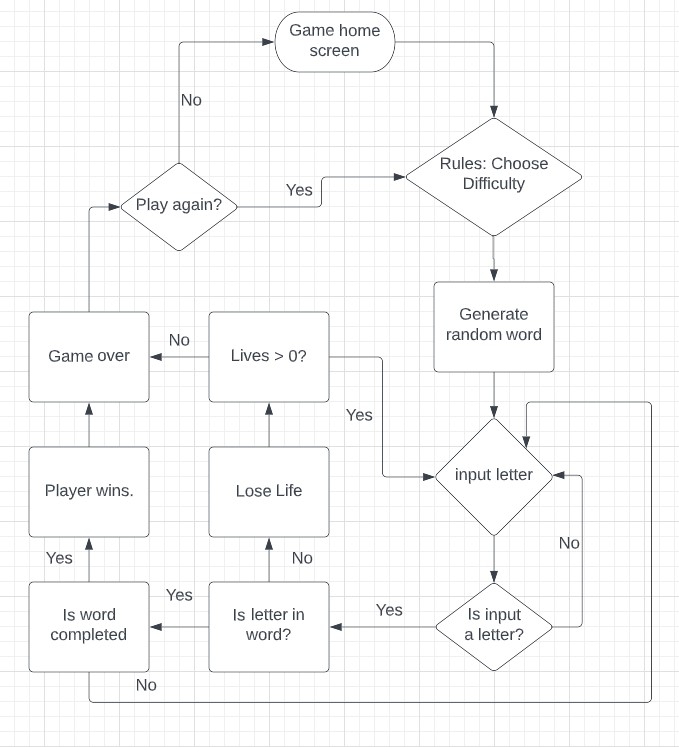
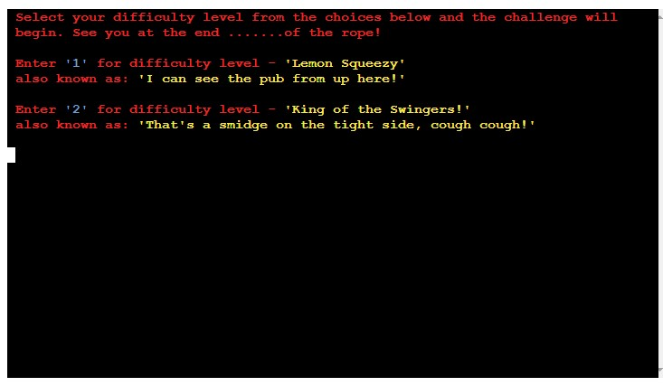
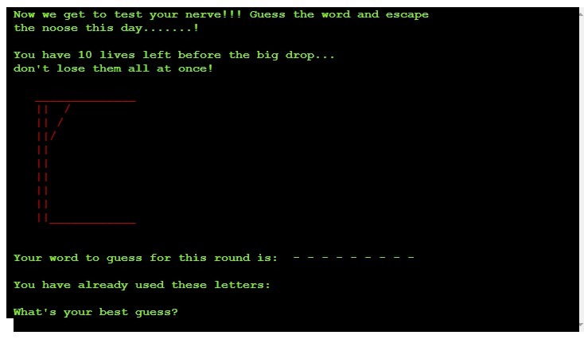
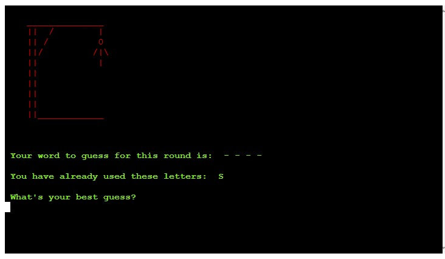
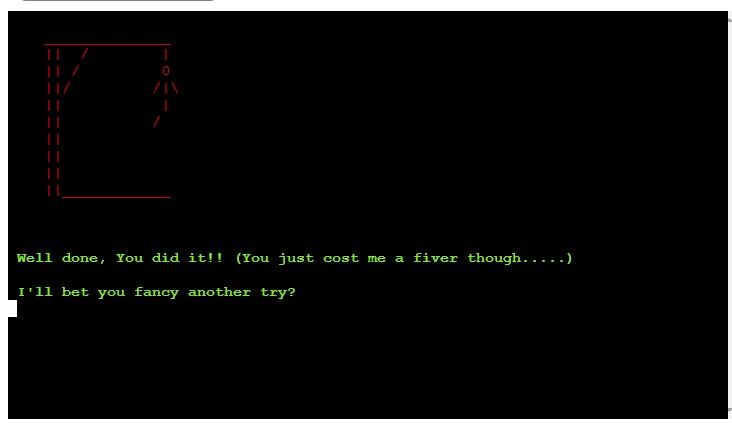
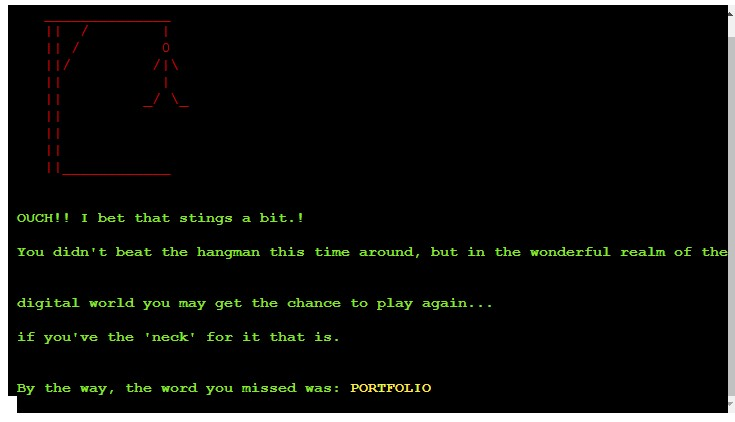
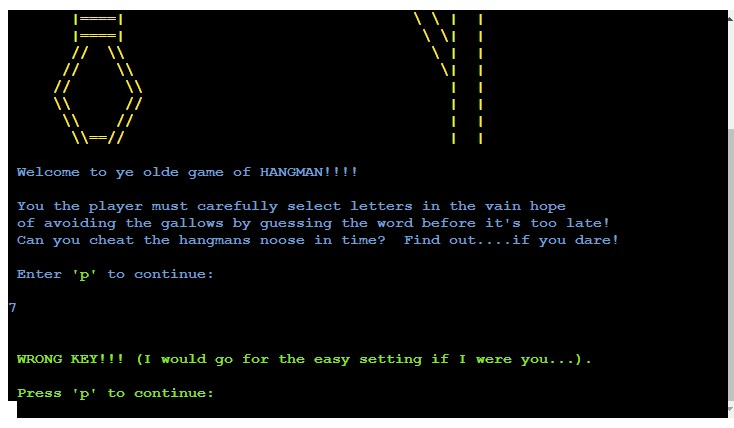

# **Hangman(with added sarcasm)**
Hangman(with added sarcasm) is written as a Python terminal game. This will run on the Code Institute terminal viewer on Heroku (until the Heroku free offering cconcludes in November 2022). A suitable alternative for hosting the live app following that date is currently being researched.

As per the standard Hangman rules, Users try to guess the word by inputting letters until they either guess the word or they lose all of their lives and forfeit the game. The target audience is anyone who likes to challenge themselves mentally with a guessing game. 

[Hangman(with added sarcasm)](https://hangman-pproj3.herokuapp.com/) - You can view the live site here. 

 

## **Table of Contents**
 * [**How to Play**](#how-to-play)
 * [**Planning Stage**](#planning-stage)
 * [**Features**](#features)
 * [**Testing**](#testing)
 * [**Languages Used**](#languages)
 * [**Bugs**](#bugs)
 * [**Deployment**](#deployment)
 * [**Credits**](#credits)

## **How to Play**
Players play Hangman(with added sarcasm) by typing letters into the mock terminal. The purpose of the game is to guess the hidden word. The words are represented with empty dashes to show players how many letters they have to guess in order to win. when the player guesses a correct letter, the individual dashes are replaced with the correct letter.

When a player guesses incorrectly, they will receive an error message and the players lives will reduce by one. The player will then be invited to continue to input their guesses until thier total lives have run out or the word has been correctly guessed. 

The game is over either when the player has correctly guessed the word or they have run out of lives. 

## **Planning Stage**

### **User Goals**
To build a terminal based game of Hangman for users to mentally challenge themselves with a fun guessing - game platform.
* The game rules and environment should be easily interpreted and accessible for a user.
* The game should definitely be lots of fun to play.
* It should be suitably challenging and encourage users to replay many times.

### **Using FlowCharts**
 During the planning process in order to assist with the development progress and to figure out the linear process of the game I created the following flowchart.

* Where were inputs from the user needed?
* How would I deal with invalid inputs or incorrect tries?
* Were there any logic errors that could perceivably break the game?

 

 ## **Features**

 ### **Existing Features**
* Home/Start page
* Explains Game play to user
* Explains how to continue

* Choose challenge difficulty
* 'Lemon Squeezy' = 10 lives
* 'King of the Swingers!' = 5 lives

* View Game Rules

* A function randomly generates a word from a list, gamewords.py.
* The player can not see what the word is but can see how many letters are in the word denoted by _ _ _ _ _ 
* Lives are shown through graphical representation
* Depending on difficilty level chosen, the user has a limited amount   of lives before game ends.
   
 

* Game Over Screens.
* A custom comment appears for winning the game and for game over.
 
 
* Users can choose whether to restart the game or go back to the main menu.

* Checks for invalid inputs.
* For all user inputs, checks are run to ensure there are no invalid inputs submitted.
* For any invalid submissions, a tailored error message is displayed and the user is prompted to input their selection again.

## **Future Functionality Ideas**
* An option for the user to input the whole word if they guess it correctly before the game is over.
* Increase the level of difficulty by adding a third option where each turn is timed. If the timer runs down a life is lost..
* increase number of words in game word file. 

## **Testing**
* Code was run through a PEP8 linter using (http://pep8online.com/) to identify and fix any errors.
* Manually tested the application by inputting all possible iterations of user responses and measuring the outcome with the expected parameters to confirm all were functioning as they should be. (within the IDE environemnt and in the deployed environment via the Heroku platform.
## **Languages**
* Python.
## **Bugs**
* When implementing hangman graphics, initially lives retreated from fully hanged man to nothing. Had to reverse order and set appropriately.
* A lot of adjustment and modification required for the Heroku terminal viewer. Too may lines overlapped and graphics were half off the screen.

## **Deployment**
The project was deployed onto the Heroku platform. This is a temporary solution as Heroku is set to stop provision of free hosting from November 2022. Alternative options are currently being researched. 

* Steps to deploy while hosted via the Heroku platform:
  * Fork or clone this repository.
  * Ensure the Procfile is in place.
  * requirements.txt can be left empty as this project does not use any external libraries. 
  * Create a new app in [Heroku](https://dashboard.heroku.com/apps).
  * Select "New" and "Create new app".
  * Name the new app and click "Create new app".
  * In "Settings" select "BuildPack" and select Python and Node.js. (Python must be at the top of the list).
  * Whilst still in "Settings", click "Reveal Config Vars" and input the folloing. KEY: PORT, VALUE: 8000. Nothing else is needed here as this project does not have any sensitive files.
  * Click on "Deploy" and select your deploy method and repository.
  * Click "Connect" on selected repository. 
  * Either choose "Enable Automatic Deploys" or "Deploy Branch" in the manual deploy section. 
  * Heroku will now deploy the site.

  ## **Credits**
 * [Code Institute](https://codeinstitute.net/) plus the extended Code Institute community via Slack for their invaluable support. How to deploy to Heroku.

 * [FreeCodeCamp](https://www.freecodecamp.org/) for additional coding and python information.